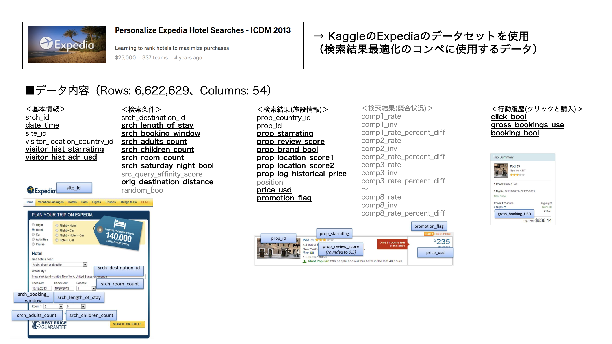
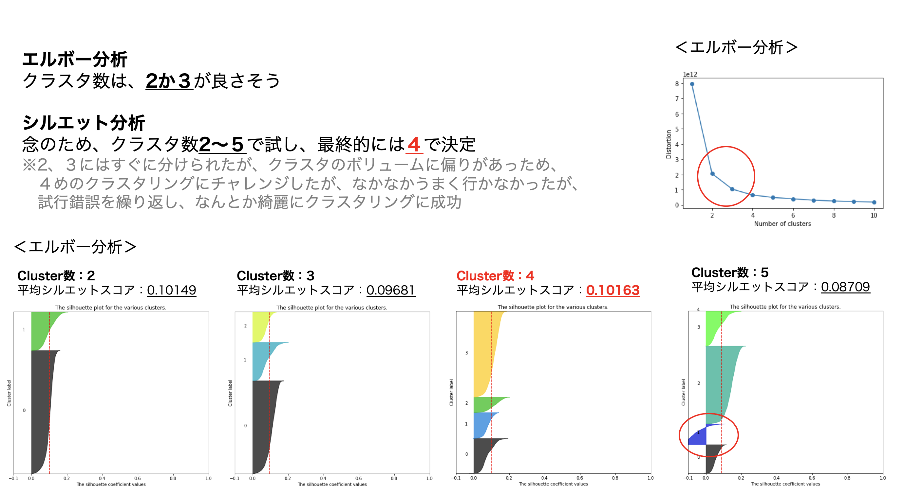
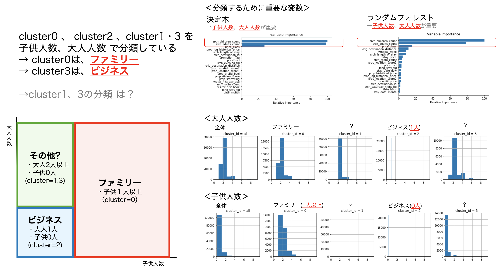
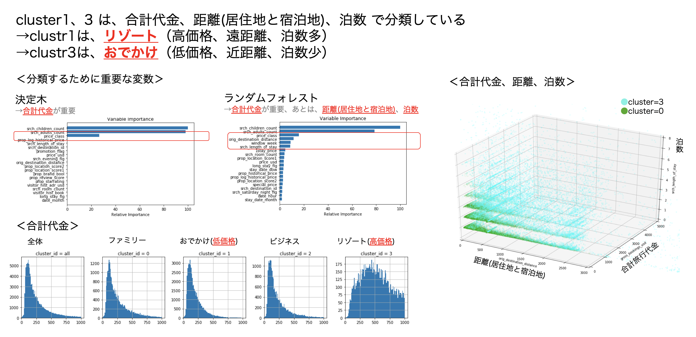
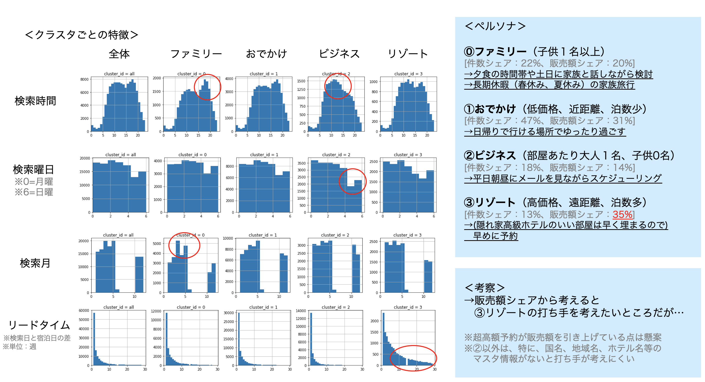
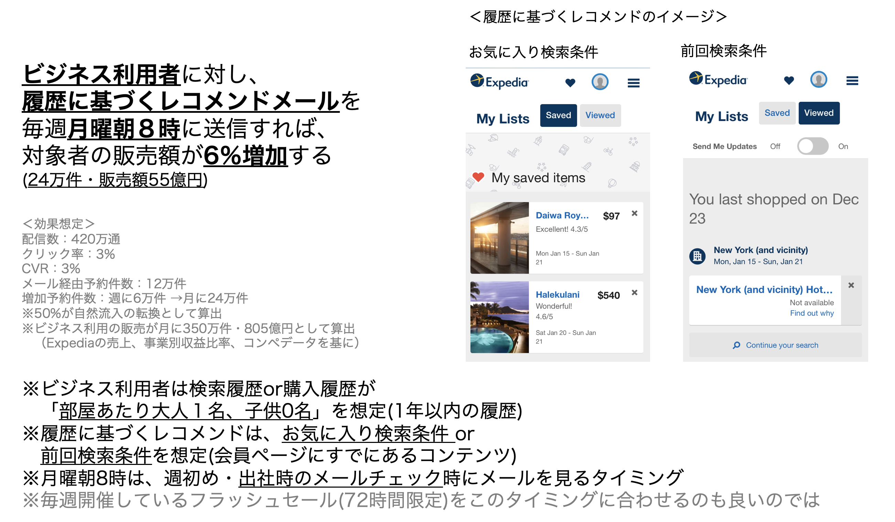

# Customer-Clustering-From-Hotel-Serch-Log
旅行会社のログデータを活用した顧客クラスタリング

### 1.使用データ 
Personalize Expedia Hotel Searches 
https://www.kaggle.com/c/expedia-personalized-sort 
 

### 2.基礎分析と欠損値処理

### 3.特徴量作成
#### ・検索日時から、検索曜日、検索時間帯、検索月、検索日を作成 
#### ・検索日時とリードタイムから、宿泊曜日、宿泊月、宿泊日を作成 
#### ・子供人数と大人人数から、ファミリーフラグ、ビジネスフラグを作成 
※クラスタリングに役に立たなくても、特徴把握で役に立つものも多かった 
※ちなみに他にも大量に変数作成したがほとんど失敗 
（ハイシーズンフラグ、人気地域ランク、価格UP率、当日予約・前日予約フラグ…） 

### 4.「Kmeans++」でクラスタリングし、エルボー分析、シルエット分析で特徴量を加減

### 5.「決定木」「ランダムフォレスト」で、クラスタリングに使用した特徴量と重要度を確認

### 6.各クラスタごとの特徴（分散）を可視化し確認

### 7.「4〜6」を繰り返し

### 8.クラスタの傾向からペルソナ設定

### 9.打ち手の検討とABテスト設計

